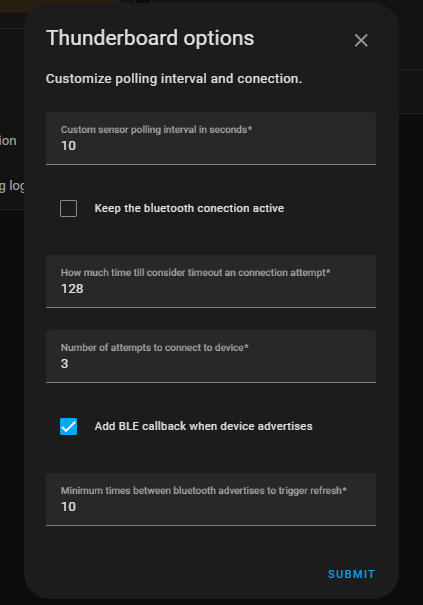
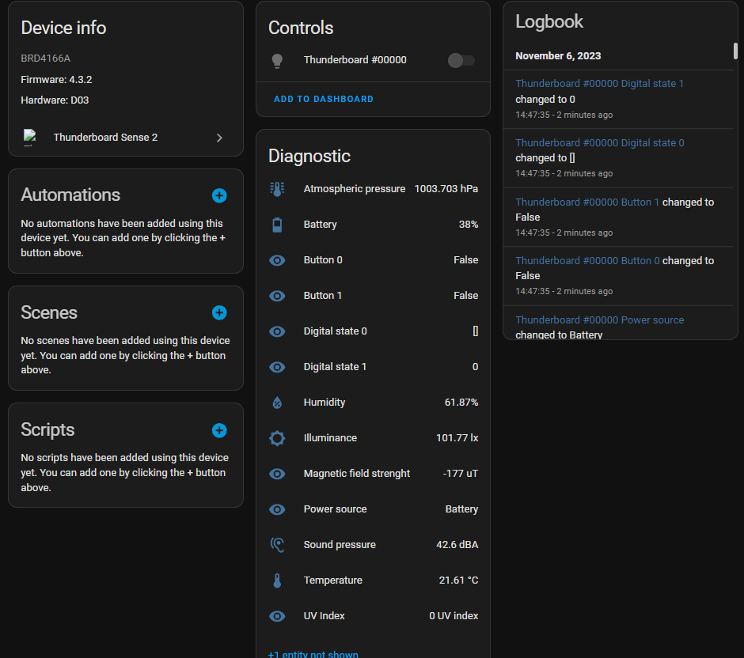

# Description
Custom component that integrates Silicon Labs Thunderboard Sense 2 with the Home Assistant. This is a demonstration of how you can integrate the device, and it's tested in practice.

You can read the Medium article about how I've brought this integration up [here (no paywall link)](https://che-adrian.medium.com/bringing-a-new-ble-device-to-the-home-assistant-silabs-thunderboard-example-1f0d6094c84b?sk=cdbbac98afde4fe459c585f03fc132c1).

# Installation
You need to manually copy the thunderboard directory from custom_components into the `<config>/custom_components/` directory (so you end up with `<config>/custom_components/thunderboard`).

# Debugging
Into your configuration.yaml

    logger:
      default: warning
      logs:
        custom_components.thunderboard: debug

# Functions
This helps you to integrate the board sensors with the Home Assistant, compatible with the base software that comes with the board named Bluetooth - SoC Thunderboard Sense 2, which you can update through Simplicity Studio.

Using this integration, you can:

- Read sensors values for:
    - Atmospheric pressure
    - Humidity
    - Illuminance
    - Magnetic field strength
    - Sound pressure
    - Temperature
    - UV Index

- Read buttons and digital IO states
- Power source check if it is USB or battery
- Control RGB LED lights of the board

Additionally, you can:

- Customize device polling time
- Keep connection active
    - This might draw battery fast, but you can read both the buttons states instantly (using the built-in BLE notification of module)
- Customize timeout and connections attempts
- Add callback to read data from device when there's a change in BLE advertisement
- Set the minimum time between the above-mentioned callback trigger

## Images

Integration configuration             |  Sensors from the board
:-------------------------:|:-------------------------:
 |   
